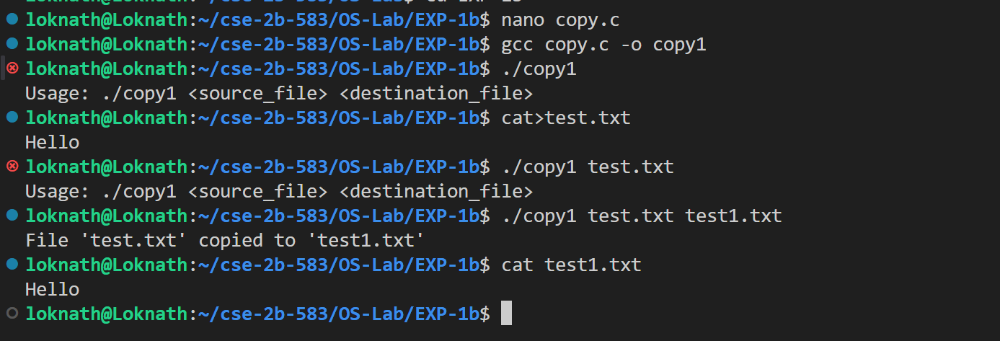

> ## Simulate UNIX commands like cp, ls, grep, etc
### Program Statemnt: To simulate UNIX command like cp,ls,grep
### Source Code
### Cp simulate command Source code
```c
#include <stdio.h>
#include <stdlib.h>
void simulate_cp(const char *source, const char *destination) {
FILE *src = fopen(source, "r");
FILE *dest = fopen(destination, "w");
if (!src || !dest) {
perror(!src ? "Error opening source file" : "Error opening destination file");
if (src) fclose(src);
return;
}
char buffer[1024];
size_t bytes;
while ((bytes = fread(buffer, 1, sizeof(buffer), src)) > 0) {
fwrite(buffer, 1, bytes, dest);
}
printf("File '%s' copied to '%s'\n", source, destination);
fclose(src);
fclose(dest);
}
int main(int argc, char *argv[]) {
if (argc != 3) {
fprintf(stderr, "Usage: %s <source_file> <destination_file>\n", argv[0]);
return EXIT_FAILURE;
}
simulate_cp(argv[1], argv[2]);
return EXIT_SUCCESS;
}
```
### Interpretation of program: 
1) The program takes the two command-line arguments: source-file and destination-file
2) It open the source file in read-only mode ("r")
3) It open the destination file in write only mode("w").
4) If either file cannot be opened. It prints an error message and exits.
5) It reads the contents of the source file in chunks of 1024 bytes using fread.
6) It writes each chunk to the destination file using fwrite.
7) It writes once the entire source file has been copied, it prints a succes manager
  
### Output of the code for cp


> ### Simulation code for ls command
```c
#include <stdio.h>
#include <stdlib.h>
#include <dirent.h>
void simulate_ls(const char *path) {
struct dirent *entry;
DIR *dir = opendir(path);
if (!dir) {
perror("Error opening directory");
return;
}
while ((entry = readdir(dir)) != NULL) {
if (entry->d_name[0] != '.') {
printf("%s ", entry->d_name);
}
}
printf("\n");
closedir(dir);
}int main(int argc, char *argv[]) {
const char *path = argc > 1 ? argv[1] : ".";
simulate_ls(path);
return 0;
}
```
### Interpretion of Program:
1. The program takes an optimal command-line argument: the path to the directory to list.
2. If no argument is provided, it defaults to the current working directory (.).
3. It opens the specified directory using opendir.
4. If the directory cannot be opened, it prints an error using perror.
5. It reads the directory entries using readdir and prints the names of the files and directories, executing hidden files.
6. Finally, it closes the directory using closedir

### Output of the code for ls


> ### Simulate Grep command
```c
#include <stdio.h>
#include <stdlib.h>
#include <string.h>
void simulate_grep(const char *pattern, const char *filename) {
FILE *file = fopen(filename, "r");
if (!file) {
perror("Error opening file");
return;
}
char line[1024];
while (fgets(line, sizeof(line), file)) {
if (strstr(line, pattern)) { // Check if pattern exists in the line
printf("%s", line);
}
}
fclose(file);
}int main(int argc, char *argv[]) {
if (argc != 3) {
fprintf(stderr, "Usage: %s <pattern> <filename>\n", argv[0]);
return EXIT_FAILURE;
}
simulate_grep(argv[1], argv[2]);
return EXIT_SUCCESS;
}
```
### Interpretation Program:
1. The program takes two command-line arguments: the paltern to search for and the file name to search in
2. It opens the specified file in read-only mode("r").
3. If the file cannot be opened, it prints an error message perror
4. It reads the file line by line using fgets.
5. For each line, it checks if the specified pattern exists using strstr.
6. If the pattern is found, it prints the entire line.
7. finally, it closes the file using fclose.

### Output of the code for grep


### Result: Thus the study and execution of UNIX commands like cp,ls,grep has been completed successfully
